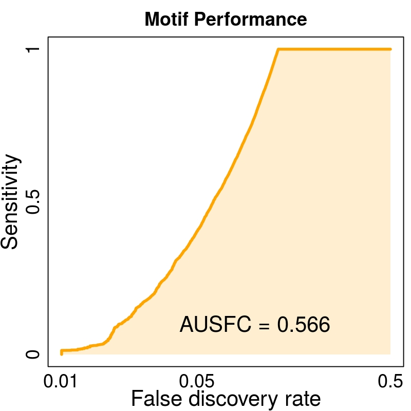
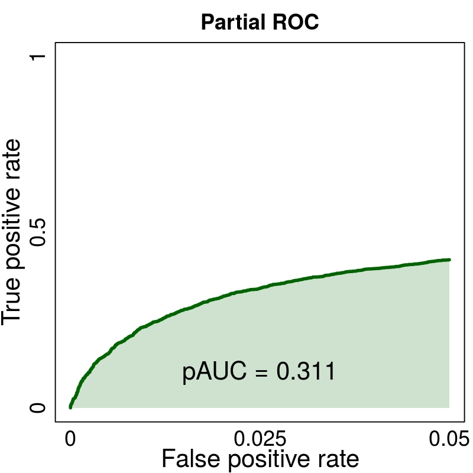
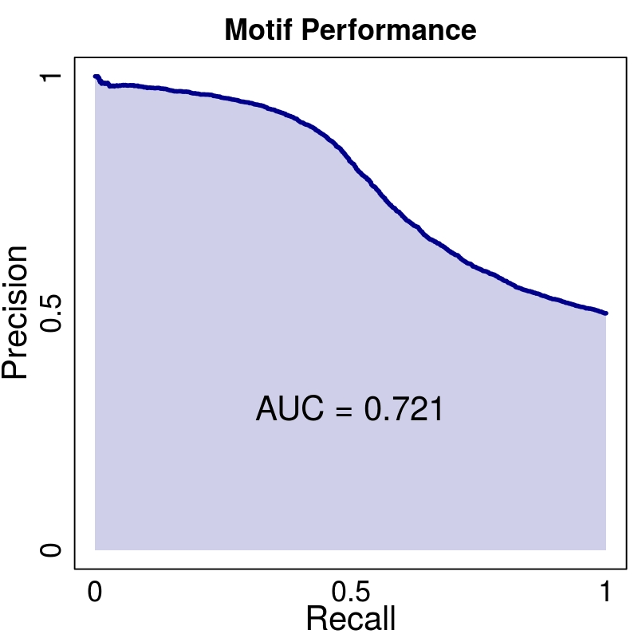
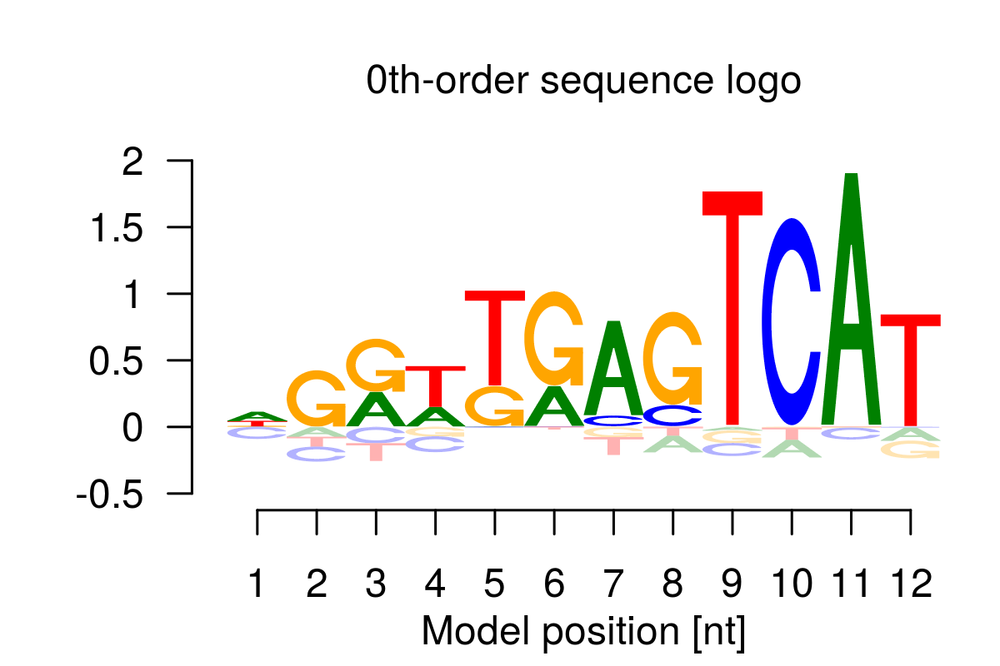
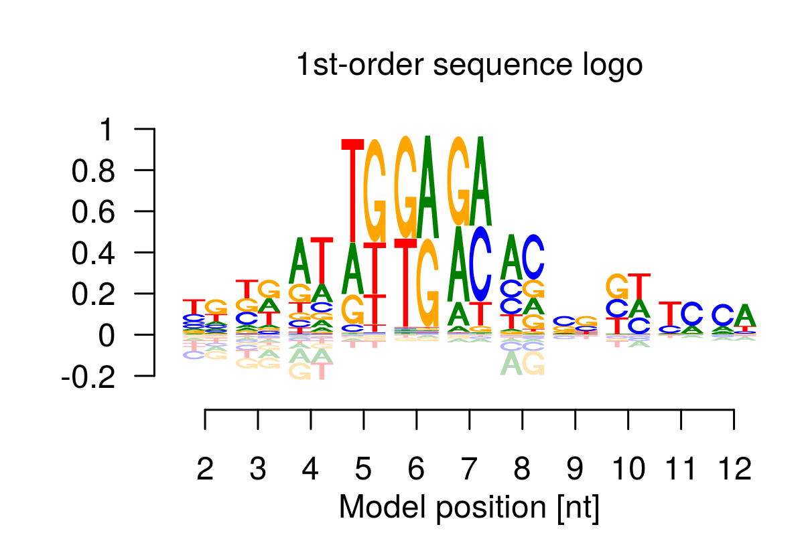
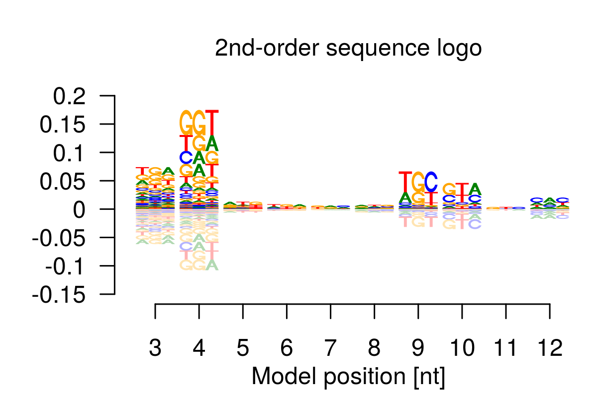
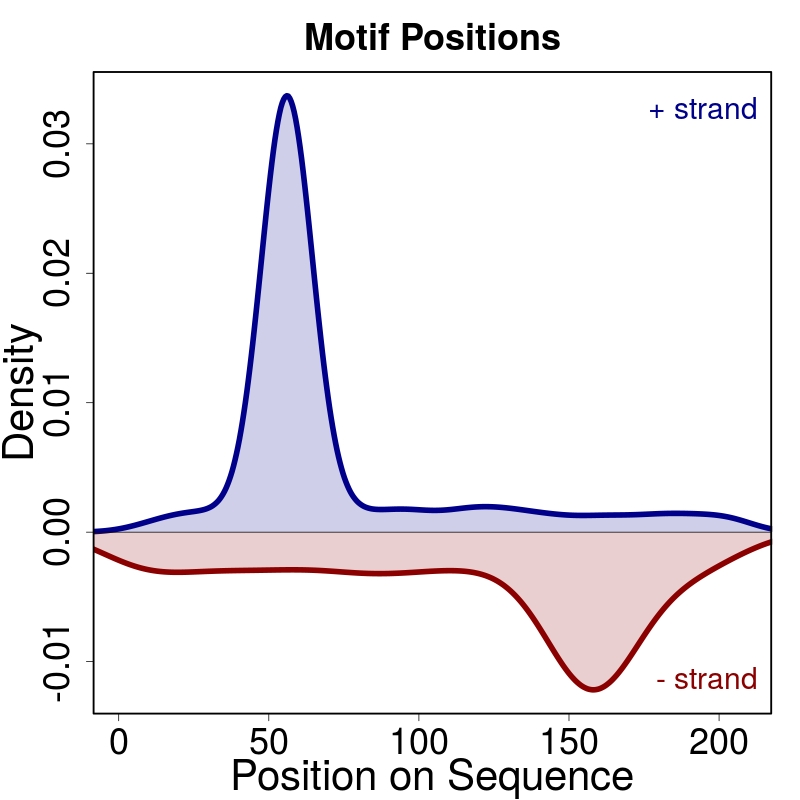
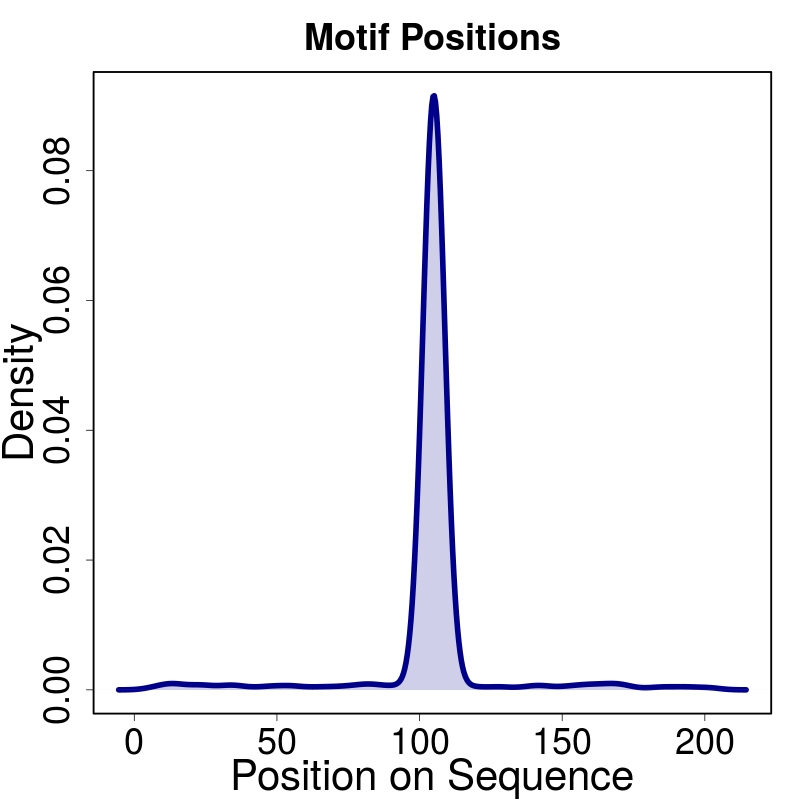

# BaMM!motif - v2

**Ba**yesian **M**arkov **M**odel **motif** discovery software (version 2).

(C) Johannes Soeding, Wanwan Ge, Anja Kiesel, Matthias Siebert

## Requirements
To compile from source, you need:

  * [GCC](https://gcc.gnu.org/) compiler 4.7 or later  (we suggest GCC-5.x)
  * [CMake](http://cmake.org/) 2.8.11 or later
  
C++ packages
  * [Boost](http://www.boost.org/) 

To plot BaMM logos you need R and several R packages 

  * [R](https://cran.r-project.org/) 2.14.1 or later
  * install.packages( "zoo" )
  * install.packages( "argparse" )
  * install.packages( "fdrtool" )
  * install.packages( "LSD" )
  * install.packages( "grid" )
  * install.packages( "gdata" )

## Installation

### Clone it from GIT

      git clone git@github.com:soedinglab/BaMMmotif2 BaMMmotif
      cd BaMMmotif

### How to compile BaMM!motif?

#### Linux
      mkdir build
      cd build
      cmake -DCMAKE_INSTALL_PREFIX=${HOME}/opt/BaMM ..
      make
      make install
      
Adjust `${HOME}/opt/BaMM` if you want to change the directory for installation

#### OS X
OS X ships clang instead of gcc. We recommend using [Homebrew](http://brew.sh/) to install gcc.

Having installed Homebrew, all required dependencies can be installed using the `brew` command

      brew tap homebrew/versions
      brew tap homebrew/science
      brew install gcc5 cmake R

#### Compilation

      export CXX=g++-5
      export CC=gcc-5
      export LDFLAGS="-static-libgcc -static-libstdc++"

      mkdir build
      cd build
      cmake ..
      make
      
#### Environment setup
Add this line to your $HOME/.bashrc (or .zshrc...) to add BaMMmotif to your PATH:

    export PATH=${PATH}:${HOME}/opt/BaMM/bin
    
Update your environment:    

    source $HOME/.bashrc

## How to use BaMM!motif from the command line?

### SYNOPSIS

      BaMMmotif DIRPATH FILEPATH [OPTIONS]

### DESCRIPTION

      Bayesian Markov Model motif discovery software.

      DIRPATH
          Output directory for the results.

      FILEPATH
          FASTA file with positive sequences of equal length.

### OPTIONS

Sequence options

      --alphabet <STRING>
          STANDARD.         For alphabet type ACGT, default setting;
          METHYLC.          For alphabet type ACGTM;
          HYDROXYMETHYLC.   For alphabet type ACGTH;
          EXTENDED.         For alphabet type ACGTMH.
      
      --ss
          Search motif only on single strand strands (positive sequences).
          This option is not recommended for analyzing ChIP-seq data.
          By default, BaMM searches motifs on both strands.
          
      --negSeqSet <FILEPATH>
          FASTA file with negative/background sequences used to learn the
          (homogeneous) background BaMM. If not specified, the background BaMM
          is learned from the positive sequences.

  Options to initialize BaMM(s) from file

      --bindingSiteFile <FILEPATH>
          File with binding sites of equal length (one per line).
      
      --PWMFile <STRING>
          File that contains position weight matrices (PWMs).
      
      --BaMMFile <STRING>
          File that contains a model in bamm file format.

      --maxPWM <INTEGER>
          Number of models to be learned by BaMM!motif, specific for PWMs.

  Options for the (inhomogeneous) motif BaMMs

      -k|--order <INTEGER>
          Model order. The default is 2.

      -a|--alpha <FLOAT> [<FLOAT>...]
          Order-specific prior strength. The default is 1.0 (for k = 0) and
          beta x gamma^k (for k > 0). The options -b and -g are ignored.

      -b|--beta <FLOAT>
          Calculate order-specific alphas according to beta x gamma^k (for
          k > 0). The default is 7.0.

      -g|--gamma <FLOAT>
          Calculate order-specific alphas according to beta x gamma^k (for
          k > 0). The default is 3.0.

      --extend <INTEGER>{1,2}
          Extend BaMMs by adding uniformly initialized positions to the left
          and/or right of initial BaMMs. Invoking e.g. with --extend 0 2 adds
          two positions to the right of initial BaMMs. Invoking with --extend 2
          adds two positions to both sides of initial BaMMs. By default, BaMMs
          are not being extended.
      
      -q <FLOAT>
          Prior probability for a positive sequence to contain a motif. The
          default is 0.9.
          
      -s, --sOrder <INTERGER>
          The order of k-mer for sampling pseudo/negative set. The default is 2.

  Options for the (homogeneous) background BaMM

      -K <INTEGER>
          Order. The default is 2.

      -A|--Alpha <FLOAT>
          Prior strength. The default is 10.0.
      
      --bgModelFile <STRING>
          Read in background model from a bamm-formatted file. 

  EM options

      --EM
          Triggers Expectation Maximization (EM) algorithm.
          
  Gibbs sampling options

      --CGS
          Triggers Collapsed Gibbs Sampling (CGS) algorithm.
      
      --maxCGSIterations <INTEGER> 
          Limit the number of CGS iterations.
          It should be larger than 5 and defaults to 100.

  Options for model evaluation
      
      --FDR
          Triggers False-Discovery-Rate (FDR) estimation.
        
      -m|--mFold <INTEGER>
          Number of negative sequences as multiple of positive sequences.
          The default is 10.
      
      -n, --cvFold <INTEGER>
          Fold number for cross-validation. 
          The default is 5, which means the training set is 4-fold of the test set.
          
  Output options

      --saveBaMMs
          Write optimized BaMM(s) to disk.

      --saveInitBaMMs
          Write initialized BaMM(s) to disk.
          
      --verbose
          Verbose terminal printouts.

      -h, --help
          Printout this help.

## Downstream analysis

### Evaluate the performance of BaMMs

For evaluating the optimized BaMM models, a file with extension `.stats` is required. It can be generated either by running `BaMMmotif` with `--FDR` flag, or by running `FDR` program independently.

Either

    ${HOME}/opt/BaMM/bin/BaMMmotif [OUTPUT_FIR] [FASTAFILE] [MOTIF_FILE] [options] --FDR

or

    ${HOME}/opt/BaMM/bin/FDR [OUTPUT_FIR] [FASTAFILE] [MOTIF_FILE]

R script `evaluateBaMM.R` is provided in the installation directory `${HOME}/opt/BaMM/bin` to calculate the performance score AUSFC and optionally plot precision-recall curve, partial ROC, and sensitivity-FDR curve. You can run it like:

    ${HOME}/opt/BaMM/bin/evaluateBaMM.R [INPUT_DIR] [PREFIX_OF_STATS_FILE] [options]
    
The options are:

`--SFC 1` for plotting the sensitivity-false discovery rate curve.

`--ROC5 1` for plotting the partial ROC with the first 5% of TPR.

`--PRC 1` for plotting the precision-recall curve.

You will get the following plots:

The performance scores such as AUSFC, pAUC amd AUPRC are written in the `.bmscore` file.
    
### How to plot BaMM logos?

R script `platBaMMLogo.R` is provided in the installation directory `${HOME}/opt/BaMM/bin` to plot the BaMM logo from a BaMM flat file. 

It requires output files with extension `.ihbcp`, `.ihbp`, `.hbcp` or `.hbp` from BaMMmotif as input.

The logo order is an integer between 0 to 2. 

    plotBaMMLogo.R [INPUT_DIR] [PREFIX_OF_OCCURRENCE_FILE] [LOGO_ORDER]

You will get the following plots:

### Motif distribution analysis

For visualizing the distribution of motifs in the sequence set, you need to generate either a `.occurrence` file by executing `BaMMmotif` with a `--scoreSeqset` flag or by executing `BaMMScan`.

Either

    ${HOME}/opt/BaMM/bin/BaMMmotif [OUTPUT_FIR] [FASTAFILE] [MOTIF_FILE] [options] --scoreSeqset

or
    
    ${HOME}/opt/BaMM/bin/BaMMScan [OUTPUT_FIR] [FASTAFILE] [MOTIF_FILE]
    
After obtaining a `.occurrence` file, you can run R script `plotMotifDistribution.R` provided in the installation directory `${HOME}/opt/BaMM/bin` to visualise the motif distribution:

    ${HOME}/opt/BaMM/bin/plotMotifDistribution.R [INPUT_DIR] [PREFIX_OF_OCCURRENCE_FILE] [option]

The option is:

`--ss 1` for only plotting the distribution of motif on single strand. Otherwise, it will visualize motif distribution on both strands.

You will get one of the following plots:

Note that, this analysis currently only work for sequences set with sequences of the same length.

## BaMM flat file format

BaMM!motif generates two files for each inhomogeneous BaMM: 

1. file with extension `.ihbp` contains probabilities of BaMM model;

2. file with extension `.ihbcp` contains conditional probabilities of BaMM model.

The format is the same for these two files. While blank lines separate BaMM positions, lines 1 to *k*+1 of each BaMM position contain the (conditional) probabilities for order 0 to order *k*. For instance, the format for a BaMM of order 2 and length *W* is as follows:

Filename extension: `.ihbp`

P1(A) P1(C) P1(G) P1(T) 
P1(AA) P1(AC) P1(AG) P1(AT) P1(CA) P1(CC) P1(CG) ... P1(TT) 
P1(AAA) P1(AAC) P1(AAG) P1(AAT) P1(ACA) P1(ACC) P1(ACG) ... P1(TTT) 

P2(A) P2(C) P2(G) P2(T) 
P2(AA) P2(AC) P2(AG) P2(AT) P2(CA) P2(CC) P2CG) ... P2(TT) 
P2(AAA) P2(AAC) P2(AAG) P2(AAT) P2(ACA) P2(ACC) P2(ACG) ... P2(TTT) 
...

PW(A) PW(C) PW(G) PW(T) 
PW(AA) PW(AC) PW(AG) PW(AT) PW(CA) PW(CC) PWCG) ... PW(TT) 
PW(AAA) PW(AAC) PW(AAG) PW(AAT) PW(ACA) PW(ACC) PW(ACG) ... PW(TTT) 

Filename extension: `.ihbcp`

P1(A) P1(C) P1(G) P1(T) 
P1(A|A) P1(C|A) P1(G|A) P1(T|A) P1(A|C) P1(C|C) P1(G|C) ... P1(T|T) 
P1(A|AA) P1(C|AA) P1(G|AA) P1(T|AA) P1(A|AC) P1(C|AC) P1(G|AC) ... P1(T|TT) 

P2(A) P2(C) P2(G) P2(T) 
P2(A|A) P2(C|A) P2(G|A) P2(T|A) P2(A|C) P2(C|C) P2(G|C) ... P2(T|T) 
P2(A|AA) P2(C|AA) P2(G|AA) P2(T|AA) P2(A|AC) P2(C|AC) P2(G|AC) ... P2(T|TT) 
...

PW(A) PW(C) PW(G) PW(T) 
PW(A|A) PW(C|A) PW(G|A) PW(T|A) PW(A|C) PW(C|C) PW(G|C) ... PW(T|T) 
PW(A|AA) PW(C|AA) PW(G|AA) PW(T|AA) PW(A|AC) PW(C|AC) PW(G|AC) ... PW(T|TT) 

In addition, BaMM!motif generates two files for the homogeneous background BaMM:
1. file with extension `.ihbp` contains probabilities of background model;

2. file with extension `.ihbcp` contains conditional probabilities of background model.

For instance, the format for a background BaMM of order 2 is as follows:

Filename extension: `.hbp`

P(A) P(C) P(G) P(T) 
P(AA) P(AC) P(AG) P(AT) P(CA) P(CC) P(CG) ... P(TT) 
P(AAA) P(AAC) P(AAG) P(AAT) P(ACA) P(ACC) P(ACG) ... P(TTT) 

Filename extension: `.hbcp`

P(A) P(C) P(G) P(T) 
P(A|A) P(C|A) P(G|A) P(T|A) P(A|C) P(C|C) P(G|C) ... P(T|T) 
P(A|AA) P(C|AA) P(G|AA) P(T|AA) P(A|AC) P(C|AC) P(G|AC) ... P(T|TT) 

## License

BaMM!motif is released under the GNU General Public License v3 or later. See LICENSE for more details.

## Notes

We are welcoming bug reports! Please contact us at soeding@mpibpc.mpg.de .

For the seeding phase, we recommend to use our de novo motif discovery tool [PEnG-motif](https://github.com/soedinglab/PEnG-motif).